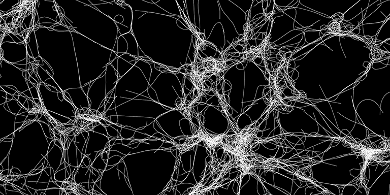

# Cytosim

Cytosim is a cytoskeleton simulation suite designed to handle large systems of flexible filaments with associated proteins such as molecular motors. It is a versatile base that has been used to study actin and microtubule systems in 1D, 2D and 3D. It is built around a cross-platform C++ core engine that runs on UNIX, Mac OSX, GNU/Linux and within Cygwin on Windows. The code is modular and extensible, making Cytosim a convenient base that can be customized to meet particular tasks. Some of the most upstream operations are implemented in Python.

Cytosim is a suite of command-line tools with simulation and display capabilities. The simulation is specified in a [configuration file](doc/sim/config.md), defining objects, their parameters and a suite of operations, such as advancing time, saving frames or [generating reports](doc/sim/report.md). Here is a basic example, with parameters specified in [units of second, micrometers and pico-Newtons](doc/sim/units.md).

	
	set simul system
	{
	    time_step = 0.005
	    viscosity = 0.02
	}
	
	set space cell
	{
	    shape = sphere
	}
	
	set fiber microtubule
	{
	    rigidity = 20
	    segmentation = 0.5
	    confine = inside, 200, cell
	}
	    
	new cell
	{
	    radius = 5
	}
	
	new 5 microtubule
	{
	    length = 11
	}
	
	run 5000 system
	{
	    nb_frames = 10
	}

# Documentation

[Link to documentation](doc/index.md)

The Brownian dynamics approach was described in:  
[Collective Langevin Dynamics of Flexible Cytoskeletal Fibers](http://iopscience.iop.org/article/10.1088/1367-2630/9/11/427/meta)

The documentation source files use [Markdown](https://en.wikipedia.org/wiki/Markdown) and are best viewed with [MacDown (Mac OSX only)](https://macdown.uranusjr.com) or [Typora (Cross platform)](https://typora.io) 

# Installation

Cytosim is distributed as source code and [must be compiled](doc/compile/index.md) before use. On Mac OS X and Linux this should be uncomplicated even if you are not familiar with compilation in general. On Windows, this is more challenging, and we suggest to [compile within Cygwin](doc/compile/cygwin.md).

To compile, enter these commands in a terminal window:

	git clone https://gitlab.com/f.nedelec/cytosim
	cd cytosim
	make

It is also possible to use [cmake](https://cmake.org):

	mkdir build
	cd build
	cmake ..
	make

For more information, please check [the compile instructions](doc/compile/index.md).
Once *cytosim* is running on your machine, check the tutorials, the page on [running simulations](doc/main/runs.md), and the examples contained in the folder `cym`. Inspect in particular the short configuration files (e.g. fiber.cym, self.cym). 

# Contributors

 The project was started in 1995, and received its name in 1999.
 We hope cytosim can be useful for your research. 
 Sincerely yours, The Developers of Cytosim:

*  Francois Nedelec        1995-
*  Dietrich Foethke        2003-2007
*  Cleopatra Kozlowski     2003-2007
*  Elizabeth Loughlin      2006-2010
*  Ludovic Brun            2008-2010
*  Beat Rupp               2008-2011
*  Jonathan Ward           2008-2014
*  Antonio Politi          2010-2012
*  Andre-Claude Clapson    2011-2013
*  Serge Dmitrieff         2013-
*  Gaelle Letort           2014-
*  Julio Belmonte          2014-
*  Jamie-Li Rickman        2014-
*  Manuel Lera-Ramirez     2017-

# Contact

Email: cytosim@cytosim.org

