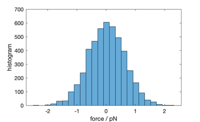

# Forces in Cytosim

The forces reported for the filament points does not include bending elasticity.

Cytosim uses Langevin Dynamics, and this means that the force have a stochastic component. Therefore the forces should generally sum up to zero, but they do so only on average, and within a certain limit that is set by the level of noise.

Let's consider a Hookean link with stiffness `stiff`, that is stretched over a distance `delta`. 
 
The force in the link is
 
	force = stiff * delta
 
and the associated energy is 
 
	1/2 stiff * delta ^ 2
	 
[Equipartition theorem](https://en.wikipedia.org/wiki/Equipartition_theorem) states that the energy associated with each degree of freedom is `1/2 kT`.
 
Thus we can derive:

	variance(delta) = kT / stiff
		
Hence
 
	variance(force) = kT * stiff
		 
# Values

Let's consider typical values:

 Parameter   | Default value    |
 ------------|-------------------
 kT          | 0.0042 pN.um
 Stiffness   | 100    pN/um

The noise in the output will be:

	variance(position) ~ kT / stiff ~ 42 nm^2
	variance(force) ~ kT * stiff ~ 0.42 pN^2

Or

	deviation(position) ~ 7 nm
	deviation(force) ~ 0.7 pN

# Example

Histogram of the forces extracted using `report single:force forces.txt`:

