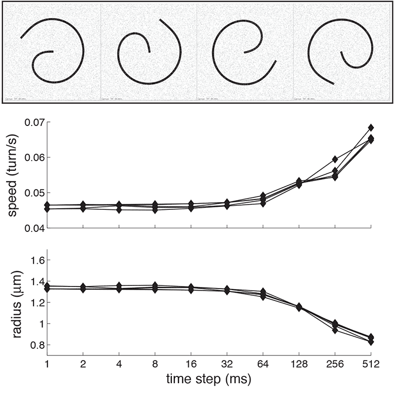

# Numerical parameters

A number of parameters in Cytosim affect the numerical precision of the calculation. 

- `time_step`: the increment of time for each step,
- `segmentation`: the distance between the points on the filaments, 
- `tolerance`: the amount of error permitted in the solution

The suggested starting value are:

- `time_step`: 0.001 sec,
- `segmentation`: 0.5 um, 
- `tolerance`: 0.05 unitess (the default value)

For all these parameters, lower values increase precision, making the simulation slower to calculate. Mathematically, Cytosim uses a stable, consistent, first-order method ([Numerical_methods](https://en.wikipedia.org/wiki/Numerical_methods_for_ordinary_differential_equations)).
This means that it will converge to the exact solution, when all these parameters are `infinitely small`.

However since the equations include Brownian motion, infinite precision is not generally needed. It is generally sufficient to solve the system with a precision exceeding this natural noise.
In practice, optimal values often arise from a compromise between accuracy and CPU costs. 

This document describes how systematic scans over the reasonable range of value will help to find suitable values.

## `time_step`

Lower values are better, but require more steps to be performed to reach the same time.

Now, the value of `time_step` should be okay, but you should check how the simulation fails at higher values. You can do this starting with a setup that exhibit the correct dynamics (and that is not too expensive to calculate). You need to develop one or several `metrics` to characterize this dynamic. Systematically increase `time_step` and monitor the dynamics. for small `time_step`, the dynamic should converge to the `true value`, while from high `time_step` it will depart from it. The plot should tell you when that happens. You can then chose a safe value.

You can probe the range [ 0.001;  0.512 ]

The number of iterations needs to be adjusted, to keep the same amount of total time. 

Here is such a plot done on a different setup, where it failed around 0.064. In this case, a `safe choice` would be 0.004 but perhaps a value of 0.008 would be okay.

## `segmentation`

Lower values are better, but increase the number of degrees of freedom of the system. As the matrices get larger, this increases both memory and computation requirements. Everything gets slower very quickly. This parameter typically has a huge influence on computation time.

Again, you systematically vary `segmentation` while measuring the system dynamics, as described above. At some point it will fail and you want to know when that happens.

You can probe the range [ 0.25;  1.0 ]

## `tolerance`

This parameter defines the level of error that is permitted when [solving the equations of motion](https://en.wikipedia.org/wiki/Biconjugate_gradient_stabilized_method). `tolerance` is given as a ratio between the actual error in each coordinate, and the level of Brownian noise present in the system. Hence a value of '0.05' means that the error should not be greater than 5% of the Brownian noise. With this value, the error should be negligible indeed!

Lower values are better, but increase the number of steps that are needed to solve the equations of motion with the given precision. 

While the default value `tolerance=0.05` should be appropriate, a higher value might be possible.

Again, starting from a suitable configuration file, systematically increase `tolerance` and measure the same collision dynamics. At some point it will fail and you want to know when that happens.

You can probe the range [ 0.01;  5.12 ]

### About this document

FJN 22.06.2020

