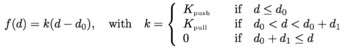
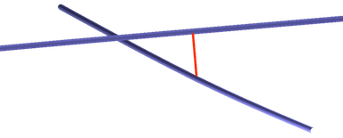

# Steric interactions

In Cytosim, a ‘steric’ filament-filament interaction can include both attractive and repulsive forces. The interaction force is piecewise linear:

where d is the distance between the two interacting elements, `d_0` is the distance at which the these elements are at equilibrium (this is for example the effective fiber diameter, which is larger than their real diameter), `d_1` is the extra interaction distance between objects. It cannot be negative. Setting `d_1 > 0` will make the interaction 'attractive'. There are two values for the stiffness parameters, one for the short-range repulsive force (`K_push`), and one for the longer range attractive force (`K_pull`). In most cases, you can set `d_1=0` to have only repulsive forces. 

Effectively, we check all the vertices (model-points) of the filaments, and project them on segments nearby. On the example depicted on the figure, if P is a vertex of the green filament, it is projected on the line supporting the segments of the other filament. When the projection falls inside the segment, this defines a position Q. If the distance is smaller than the specified threshold, a force directed along PQ is applied to the green filament in P, and to the blue filament in Q. These forces are exactly opposite and have the magnitude given in the formula above. Since all the vertices will eventually be considered, the result is symmetric for any pair of filaments: the vertices of the green filament are projected onto the blue filament, and vice versa. The sum of all forces created by steric interaction is always zero.

The vectorial force is orthogonal to one of the filaments. This is done to reduce friction on the filaments, in the sense that steric interaction does not restrict the filaments from sliding parallel to each other, for example due to the activity of crosslinking motors. The force parallel to the filament is null if the two filaments are straight and parallel. If the two filaments were not parallel, the force associated to P would still be orthogonal to the blue filament in Q, but not to the green filament.

In 3D, the segments that constitute the filaments are also checked two-by-two, to identify crossings that are undetected by the procedure described above. If the distance between the two segments is closer than the specified threshold, the interaction is included along the path of the shortest distance, which is a line orthogonal to the two segments, as indicated on the figure:
 

This is only done in 3D, but not in 2D as it would be ill-defined, since filaments when they cross do so at zero distance.

# Parameters

To enable steric, you need to set multiple parameters in the different objects:

You need to enable steric and set K\_push and K\_pull:

	set simul system
	{
	    steric = 1, 1000, 100     % enable_flag, K_push, K_pull
       ...
	}

For the filament, you must enable steric and set `d_0` and `d_1`:

	set fiber microtubule
	{
	    steric = 1, 0.025, 0.025  % enable_flag, d_0, d_1
	    ...
	}

For Sphere, beads and Solid, you can enable steric. The parameter `d_0` is always the radius of these objects, but `d_1` can be set:
	
	set bead ball
	{
	    steric = 1, 0.01         % enable_flag, d_1
	    ...
	}	

# Implementation

A regular grid is used to efficiently find the pairs that are within sufficient range to interact. 
