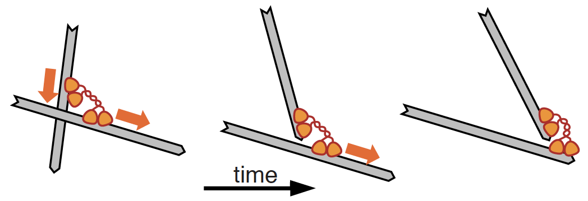

# Tutorial: Comparison of Contractile Mechanisms

Authors: Julio Belmonte (20.12.2018)

# Objective

Learn how to set up a simple simulation of a contractile actomyosin network due to the end-dwelling property of motors and compare it with the standard buckling-mediated contraction.

This tutorial is based on the following paper:

[Polarity sorting drives remodeling of actin-myosin networks](http://jcs.biologists.org/content/132/4/jcs219717)
V Wollrab, JM Belmonte, L Baldauf, M Leptin, F Nedelec, GH Koenderink
Journal of Cell Science, 132, 219717 (2019)

### Preamble

This tutorial should be done in 2D using `play`, by manually editing the configuration file. You can copy-paste the commands directly from this file into `config.cym` in your text editor.

This tutorial assumes that you have already completed the first tutorial on contractile systems [Network contraction driven by motors](tuto_contract1.md).

# Introduction

In this tutorial we will focus on a different contraction mechanism: polarity sorting. Here contraction relies on the presence of molecular motors that dwells at the end of the filament instead of automatically detaching. Because of this property, end-dwelling motors end up bring the same end of filaments together, thus contracting cytoskeletal networks into asters

# Minimal model

The first step in this tutorial is to set up a simple systems with a single filament and a few motors and test the end dwelling property of the motor. 

Lets create a small simulation space with radius 2 um and add single actin filament of length 3 um at the center:

    set simul tutorial
    {
        time_step = 0.01
    }
    
    set space cell 
    {
        shape = circle
    }
    
    new cell
    {
        radius = 2
    }

    set fiber actin
    {
        rigidity = 0.075
        segmentation = 0.15
    }
    
    new 1 fiber actin
    {
        length = 4
        position = 0,0
    }
    
    run 5000 simul *
    {
        nb_frames = 50
    }

When we add an object with the command `new` we also have the option of specifing its position with the option `position`. Here we used the coordinates 0,0 to indicate the center of the space. You can modify these coordinated to place the filament anywhere inside (or outside) the circular space. Note that side the `orientation` option was not used, every time the simulation is called the filament is placed at a random orientation.

Now let's define and add 10 myosin motors to the simulation:

    set hand motor
    {
        binding_rate = 10
        binding_range = 0.1
        unbinding_rate = 0.1
        unbinding_force = 6

        display = ( color=green; size=4; )
        
        activity = move
        unloaded_speed = 2
        stall_force = 4
    }
    
    set couple myosin
    {
        hand1 = motor
        hand2 = motor
        diffusion = 1
        length = 0.1
        stiffness = 100
    }

    new 10 couple myosin

Run the simulation and note what happens to the motor when it reaches the end of the filament. Does it stays there for a while or does it detach automatically?

Now let's change the behavior of the motors in such a way that they will now dwell at the end of the filaments instead of detaching instantaneously after reaching the end. To do that we add the property `hold_growing_end` to the hand properties:

    set hand motor
    {
     ...
     hold_growing_end = 1
     ...
    }

With this property turned on the myosin now stay and accumulate at the plus end of the filament. Note that they eventually detach due to their inherent unbinding rate.

 
# Polarity-Sorting Contraction

Now let's see how this mechanism can lead to network contraction. First let's explore ta simpler case with 2 filaments. Run it a few times and not the final state of the simulation. Next repeat the simulations again with `hold_growing_end = 0` to check what happens.

This simple case illustrates the key-feature of the end-dwelling motors, which is their ability to have one hand dwelling at the end of a filament while the other hand keeps walking along the second filament. This has the effect of bringing the two ends of the filament together. To see this feature better add the following display option to visualize the ends of the filaments:

    set fiber actin
    {
     ...
     display = ( end_style=2,4; )
     ...
    }

To better appreciate how the end-dwelling property of the motor leads to the polarity sorting of networks let's make a bigger simulations with multiple filaments. Create a simulation with radius 4 um, 100 filaments randomly distributed inside the space and 300 motors. 

Note how the final patter of this simulations resembles an aster, in contrast to the knot-like shape obtained with the filament buckling mechanism from the previous tutorial [Network contraction driven by motors](tuto_contract1.md). Because in this final shape all the minus-ends face the external of the aster and the plus-ends face the center of the aster this contraction mechanism is knowns as the Polarity-Sorting mechanism.

Now turn the end-dwelling property of the motors off and check how the network behaves. Do you still get a polarity-sorted aster? Is the network still contractile?

Make a bigger simulation in a larger space and with more filaments, but keep the number of  motors unchanged. Do you still get a single aster? Vary the number of motors and filaments and check when you get multiple asters, when you get a single one, and when you get none.

# Filament-Buckling vs. Polarity-Sorting Mechanisms

Let's compare both mechanism of network contraction.

Set the size of the simulation to be a radius of size 5 um, with 250 actin filaments of length 3 um, and 600 myosin. This setting should be sufficient to drive contraction of the whole networks into a single aster via the polarity sorted mechanism.

Now lets turn this simulation into a an example of a contractile network via the filament buckling mechanism. To do so the first thing we need to do is to turn off the end-dwelling property of the motor (`hold_growing_end = 0`) and confirm again that the network ceases do contract. Then, lets add crosslinkers back to the mix:

    set hand binder
    {
        binding_rate = 10
        binding_range = 0.1
        unbinding_rate = 0.1
        unbinding_force = 6
    
        display = ( color=blue; size=4; )
    }
    
    set couple crosslinker
    {
        hand1 = binder
        hand2 = binder
        diffusion = 1
        length = 0.1
        stiffness = 100
    } 

To keep the connectivity the same as before, lets reduce the number of myosin to 200 and add 400 crosslinkers. Does the network still contract? How does the final shape of the network compare with the Polarity-Sorting mechanism? Would you say it contracts more or less than before? Faster or slower?

Now let's check how each mechanism perform under different filament stiffness. Change the rigidity of the filaments from actin values (`0.075`) to microtubule values (`22`). Does the Filament-Buckling mechanism still works? What about the Polarity-Sorting?

While the two mechanism are conceptually very distinct, there is no reason why both of them could not be actin simultaneously to drive network contraction. Repeat the simulations again for actin-like rigidity (`rigidity = 0.075`) and add 300 units of crosslinkers and end-dwelling myosins. Does the network still contract?

Try varying the ratio of crosslinkers to end-dwelling myosin. Do you not any difference in network contraction? Can you tell when each of the mechanisms is dominant? Is that what you would expect given the requirements of each mechanism?

# The end!

Congratulations, you have completed the tutorial. If you have suggestions on this material, please email us at *feedback AT cytosim.org*
