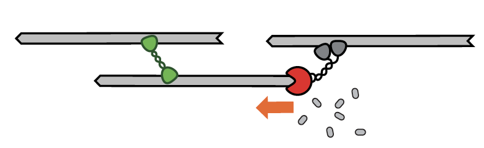

# Tutorial: Network Contraction Driven by Filament Disassembly

Authors: Julio Belmonte (10.01.2019)

# Objective

Learn how to set up a simple simulation where a dissasembling network of filaments contracts to a single spot due to the presence of a special crosslinker that harness the free-energy of the disassembling end of the filaments.

This tutorial is based on the following paper:

[A disassembly-driven mechanism explains F-actin-mediated chromosome transport in starfish oocytes](https://elifesciences.org/articles/31469)
P Bun, S Dmitrieff, JM Belmonte, FJ Nédélec, P Lénárt
eLife 7, e31469 (2018)

### Preamble

This tutorial should be done in 2D using `play`, by manually editing the configuration file. You can copy-paste the commands directly from this file into `config.cym` in your text editor.

This tutorial assumes that you have already completed the first 2 tutorials on contractile systems: [Network contraction driven by motors](tuto_contract1.md) and 

# Introduction

In this tutorial we will focus on a third contraction mechanism that, unlike the previous two, dispenses the presence of motor. Here contraction relies on the presence of molecular crosslinker that is able to track and harness the free energy of filament disassembling ends to constract the network.

# Step 1: Actin filaments

The firs step in this tutorial is to create a simple simulation composed of many filaments equal size randomly distributed inside a circle. Let's define a circular space of radius 5 um, filled with 600 filaments of length 2 um.

    set simul tutorial
    {
        time_step = 0.01
    }

    set space cell 
    {
        shape = circle
    }
    
    new cell
    {
        radius = 5
    }
    
    set fiber actin
    {
        rigidity = 0.075
        segmentation = 0.15
    }

    new 600 fiber actin
    {
        length = 2
    }

    run 5000 simul *
    {
        nb_frames = 50
    }

If you run this simulation, nothing is really accomplished: the fibers are all stable and the random fluctuations due to temperature move them around, so we expect the filaments to slowly disperse over time.

To make the filaments disassemble at a constant rate we add the activity `treadmill` to the filaments:

    set fiber actin
    {
        rigidity = 0.075
        segmentation = 0.15

        activity        = treadmill
        growing_speed   =  0.0, 0.0  
        shrinking_speed = -0.0, -0.1             
        growing_force   = 3.0, 3.0      
    }

With this activity, the filaments have the ability to either growth or shrink either of their end at fixed rates, depending on the status of each end. Parameters are:

 * `growing_speed`, the base assembly rate in um/s,
 * `shrinking_speed`, the base disassembly rate in um/s,
 * `growing_force`, the characteristic force of polymerization in pN

The two values after each option refers to the plus-end and the minus-end of the filaments. Here we set the minus-end to shrink at rate '-0.1' and left the plus-end static.

If you run this simulation nothing will change, because by default the filaments are created with their ends inactive. To change that we must specify the state of each end of the filament:

    new 400 fiber actin
    {
        length = 4
        end_state = white, red
    }

The values after the command `end_state` corresponds to the states of the plus-end and minus-end of filaments, and has the following meaning:

* static = white
* growing = green
* shrinking = red

If you run the simulation now you will note that the filaments are shrinking from their minus-ends, and eventually disappear after 20 seconds.

# Step 2: Harvesting the disassembly

Shrinking filament by themselves do not lead to overall network contraction. For that to happen we must add a connector that will help convert the shrinkage of each filament into global contraction. Let's start by setting a end-harvest connector:

set hand tracker
{
    binding_rate = 10
    binding_range = 0.1
    unbinding_rate = 0.1
    unbinding_force = 6

    display = ( color=blue; size=4; )
}

set couple crosslinker
{
    hand1 = tracker
    hand2 = tracker
    diffusion = 1
    length = 0.1
    stiffness = 100
} 

new 3000 couple crosslinker

This configuration fails to achieve global network contraction because the cross linker automatically detach when the actin monomers to which they are attach disassemble. To prevent this from happening we can convert each to a tracker that remains at the dissembling end and harvest its free energy to drag the other filament to which it is also attached to. This is done by adding the property `hold_shrinking_end = 1` to the hands.

	set hand tracker
	{
	    ...
	    hold_shrinking_end = 1
	    ...
	}

Check now if the simulation leads to network contraction or not. How does it differ from the previous 2 mechanisms?

Play with the number of connectors and check when the network fails to contract. Can you speed ups the rate of contraction by adding more end-harvesters? On what the speed of contract depends on?

Finally, set the plus-ends of the filament grow at the same rate so that the net length of the filament does not change (a condition called treadmiling). Would the network still contract? 

# The end!

Congratulations, you have completed the tutorial. If you have suggestions on this material, please email us at *feedback AT cytosim.org*

