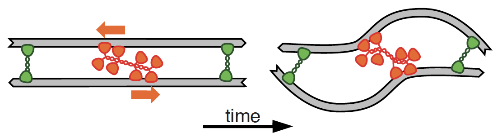

# Tutorial: Network Contraction Driven by Motors

Authors: Julio Belmonte (2.07.2018)

### Objective

Learn how to set up a simple simulation of a contractile actomyosin network due to the combined effect of myosin motors and crosslinking proteins
This is the basis of [this article](http://msb.embopress.org/content/13/9/941):

>A Theory That Predicts Behaviors Of Disordered Cytoskeletal Networks.  
>J. Belmonte, M. Leptin and F. Nedelec  
>Molecular Systems Biology, 27 Sept. 2017

### Preamble

We assume here that you have already followed [Tutorial 1](tuto_introduction.md), and that you are now familiar with the general syntax of Cytosim's configuration files. You can run a live simulation.

This tutorial should be done in 2D using `play`. You will need to manually edit the configuration file. You can copy-paste the commands directly from this file into `config.cym` in the text editor. You always need to save to make your changes visible to `cytosim`.

# Introduction

One of the basic functions of cytoskeletal networks (and of actin networks in particular) is to generate forces through contraction of filaments. This tutorial will focus on the most widely known mechanism of actin cytoskeletal contraction: filament buckling. 
This mechanism relies on the combined effect of molecular motors (myosin) and actin crosslinkers and the asymmetric response of actin filaments to compression and extension. 

# Step 1: Actin filaments

The first step in this tutorial is to define a simple simuation containing only actin filaments. Lets first create a 2D circular space of radius 4 um:

    set simul system
    {
        time_step = 0.01
    }
    
    set space cell 
    {
        shape = circle
    }
    
    new cell
    {
        radius = 4
    }
    
    run 1000 system
    {
        nb_frames = 50
    }
    
Unlike microtubles, which are usually long and rigid, [actin](http://en.wikipedia.org/wiki/Microfilament) filaments are usually short (~1 um) and semi-flexible, with a rigidity of about 0.075 pN.umˆ2. To emphasize the difference between those two types of cytokeletal filaments, let's create 25 actin filaments with lengths of 5 um:
    
    set fiber actin
    {
        rigidity = 0.075
        segmentation = 0.1
    }
    
    new 25 actin
    {
        length = 5
    }
    
In the [introduction tutorial](tuto_introduction.md) we created microtubules with segmentation length of 1 um, which is appropriate given the high rigidity of those filaments (22 pN.umˆ2). Actin filaments, however have a rigidity about 3 orders of magnitude lower, and requires a finer segmentation. Try changing the value of the segmentation and determine by yourself what would be an appropriate segmentation value to use for actin.

Actin filaments are the main component of the cell [cortex](https://en.wikipedia.org/wiki/Cell_cortex), which determines the surface tension and the shape of animal cells. The cortex is usually a ver thin layer (0.3 um thick) and can be regarded as a 2D structure. It is, however, very dense, packed with many short actin filaments. 

For a more realistic simulation of the cortex, increase the number of filaments by a factor of 10 and shorten their lengths to 2 um.

# Step 2: Crosslinking motors

Actin networks are usually contractile due to the presence of [myosin](https://en.wikipedia.org/wiki/Myosin) motors. Myosin motors usually assemble in myosin minifilaments, which can bind to at leat two nearby actin filaments. Myosin motors can therefore be modeled in Cytosim as a *couple* object with two motor hands:

    set hand motor
    {
        binding_rate = 10
        binding_range = 0.1
        unbinding_rate = 0.1
        unbinding_force = 6

        display = ( color=green; size=4; )
        
        activity = move
        unloaded_speed = 1
        stall_force = 4
    }
    
    set couple myosin
    {
        hand1 = motor
        hand2 = motor
        diffusion = 10
        length = 0.1
        stiffness = 100
    }
    
Note that since *couple* must have two hands they must be individually indicated using the tags `hand1` and `hand2`. Those hands are independent of each other and be combined with any to create hybrid objects. Because each hand attaches to a different filament, they are eventually move away from each other as the filaments move. To prevent this from happening the two bound hands acts as a Hookean spring, with the tag `length` (in um) specifying the resting length between the hands and `stiffness` (in pN) setting the spring constant between them. 

Now that the myosin object has been defined, use the command `new` to add myosins to your simulations. Can the myosins alone drive contraction of the netwok?

    
# Step 3: Crosslinking proteins

Myosins that do not dwell at the end of filaments are usually not able to drive contraction of actin networks, but instead lead to the phenomena called 'filament sliding'. Many experiments with reconstituted cytoskeleton components have shown that crosslinking proteins, such as [filamin](https://en.wikipedia.org/wiki/Filamin) and [alpha-actinin](https://en.wikipedia.org/wiki/Actinin_alpha_3), are necessary to drive actin network contraction. Crosslinkers bind and hold two actin filaments together, but do now move along the filamets. It is believed that the combined effect of myosin processivity and crosslinkg leads to contraction through the buckling of actin filaments. 

To add a crosslinking protein in your simulation, define a hand object without the `move` activity and a couple object with two hands of this kind:

    set hand binder
    {
        binding_rate = 10
        binding_range = 0.1
        unbinding_rate = 1
        unbinding_force = 6

        display = ( color=blue; size=4; )
    }
    
    set couple crosslinker
    {
        hand1 = binder
        hand2 = binder
        diffusion = 10
        length = 0.1
        stiffness = 100
    }

First investigate the behavior of the network without myosins. What is the effect that increasing number of immobile crosslinkers have on the filaments? Compare that with the case where the network is free of any binding/crosslinking proteins.

# Step 4: Network contraction

Now add back the myosins to the simulations. Start with the same number of myosins, crosllinkers and actin filaments. Do the network contract in this scenario? What happens when the number of 'connectors' (myosins and crosslinkers) is changed with respect to the total amount of actin filaments? Is there a minimum ratio required to drive global contraction?

Now let's investigate the relative contributions of motors and crosslinkers to networks contraction. For a fixed amount of crosslinkers, change the number of myosin motors and try to find out what is the best ratio of motor/crosslinker to drive contraction. 

Repeat the same approach by varying the number of crosslinkers. What happens their amount is too high? What happens when it is too low?

# The end!

Congratulation, you have completed the tutorial. If you have suggestions on this material, please email us at *feedback AT cytosim.org*

