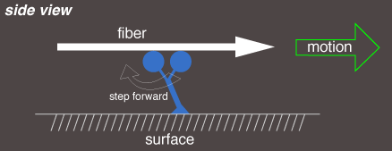
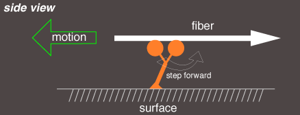

# Tutorial: Gliding Assays

Francois Nedelec (7.07.2018)

### Objective

This tutorial is directly inspired by in-vitro experiments initially used to assess the activity of [molecular motors](http://en.wikipedia.org/wiki/Molecular_motor) called 'motility assay' or 'gliding assay'. In these experiments, purified motors are attached on the surface of a coverslip, with sufficient ATP to make them operate. Filaments initially in solution will 'land' on the surface and be captured by motors. These filaments are then propelled forward, by the motors which are held immobile by their attachment on the substrate. Gliding assays have been performed both with [microtubules](https://en.wikipedia.org/wiki/Microtubule) and [actin filaments](https://en.wikipedia.org/wiki/Microfilament) and with all kinds of motors. In its most common form, the motors are uniformly distributed in a planar substrate, but in more advanced assays the motors are patterned, and multiple type of motors were used. 

This is a also the subject of interesting theoretical work, which is concerned both with the behavior of the motors, or the [trajectory of the filaments](https://journals.aps.org/prl/abstract/10.1103/PhysRevLett.74.330)

This is the basis of [this article](http://pubs.rsc.org/en/Content/ArticleLanding/2012/LC/c2lc40250e):

>**Patterns of molecular motors that guide and sort filaments.**  
>B. Rupp and F. Nedelec  
>Lab on a chip, 12, 4903—10 (2012)

# Setting up

We assume here that you have already followed [Tutorial 1](tuto_introduction.md), and that you are now familiar with the general syntax of Cytosim's configuration files, and you can run a live simulation from the command-line.

This tutorial should be done in 2D using `play`, by manually editing the configuration file. You can copy-paste the commands directly from this file into `config.cym` in your text editor.

You can start with [this configuration file](data/gliding.cym). 
Let's see what this files contains.

# Building the System

We first define the system, and its global parameters:

	set simul system
	{
	    time_step = 0.005
	    viscosity = 0.1
	    precondition = 0
	    display = ( style=2; label=(Gliding assay -); )
	}
	
We will use [periodic boundary conditions](https://en.wikipedia.org/wiki/Periodic_boundary_conditions), with a cell size of 4 x 4 um:

	set space cell
	{
		shape = periodic
	}

	new cell
	{
		length = 4, 4
	}

### Microtubules

We define filaments of fixed length, with a rigidity that is characteristics of Microtubules:
	
	set fiber microtubule
	{
	    rigidity = 20
	    segmentation = 0.25
	}
	
### Immobile motors

To make 'immobile motors' we will first define a 'Hand' with a motor activity, and then a 'Single' with 'activity = fixed':
	
	set hand kinesin
	{
	    binding_rate = 10
	    binding_range = 0.01
	    unbinding_rate = 0.3
	    unbinding_force = 2.5
	    
	    activity = move
	    unloaded_speed = 0.4
	    stall_force = 6
	}
	
	set single grafted
	{
	    hand = kinesin
	    stiffness = 100
	    activity = fixed
	}

The parameters of 'kinesin' are taken from [Bourdieu et al. PRL Vol 75 Page 176-179](https://doi.org/10.1103/PhysRevLett.75.176).
The stiffness specified in 'set single' is the stiffness of the link between the substrate and the motor. It has [units of pico-Newton per micro-meter](sim/units.md).

### Simulation

To complete the simulation, we create the objects with `new`. They are placed here by default at random positions within the `cell`:

	new microtubule
	{
	    length = 5
	}
	
	new 16000 grafted

Finally, we instruct cytosim to calculate 5000 `time_step` and to save 50 frames:
	
	run system
	{
	    nb_steps = 5000
	    nb_frames = 50
	}

To check everything, run the simulation with 'sim' and display the results with 'play'.

# Exploring the System

At this stage, you can exercise your imagination and explore various directions:

- Create a gradient of motors. Would the filaments go towards the regions of higher density, or towards the regions of lower density?

hint: to create a gradient along the X-direction, use:
	
		new 1000 grafted ( gradient 10 -10 )

- Create two types of motors: minus and plus-end directed. What happens when they are mixed equally on the surface? Can you also segregate them on different areas? What happens then?

hint: to create two stripes of motors, use:
	
		new 2500 grafted1 ( stripe  -5  0  )
		new 1200 grafted2 ( stripe   0  5 )

- It is also possible to place motors along lines, and to draw in this way patterns. Do you think that it is possible then to direct the filaments towards a particular direction? Can you find a pattern in which all filaments eventually move in the same direction?

hint: You can place motors along 'circle' and 'rectangle', and move them with 'at' or rotate them with 'align':
	
		% female motif
		new 3000 grafted1 ( circle 3 0.2 at -3 2 )
		new  500 grafted1 ( rectangle 0.1 2 0.1 at -3 -3.0 )
		new  500 grafted1 ( rectangle 2 0.1 0.1 at -3 -2.9 )
		
		% male motif
		new 3000 grafted2 ( circle 3 0.2 at +3 -2 )
		new  500 grafted2 ( rectangle 1.5 0.1 at 4.5 0 align 1 1.5 at 3 -2 )
		
		new  500 grafted2 ( rectangle 1.0 0.1 at -1.0 0 align 1 +1 at 6 0 align 1 1.5 at 3 -2 )
		new  500 grafted2 ( rectangle 1.0 0.1 at -1.0 0 align 1 -1 at 6 0 align 1 1.5 at 3 -2 )

- What can you do if you are given motors that plus-end directed and motors that are minus-end directed?

- You are now given motors that move in the same direction, but one kind that is fast and another kind that is slow? What sort of device can you build?

		new 250 grafted1 ( line 11 at -5 0 )
		new 350 grafted1 ( arc 15.7 3.14 turn -1 0 0 at 0 0 )
		new 100 grafted2 ( line 1 at 2.5 0 )

- Are there other things you would like to explore?

# The end

Congratulation, you have completed the tutorial.
If you are interested in this kind of work, do not miss [this publication](https://doi.org/10.1039/C2LC40250E).
