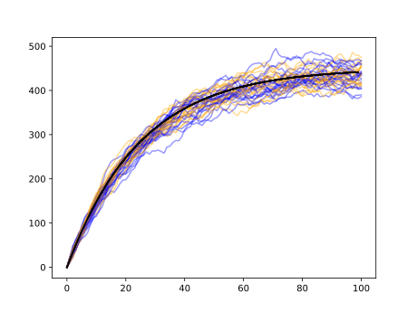
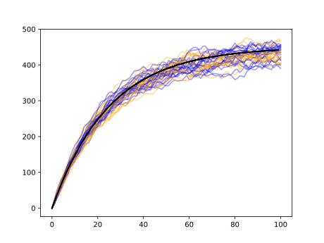
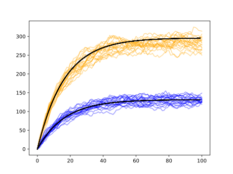

# Test for fast_diffusion with a constant concentration

This is a test for the `fast_diffusion` in mode `FAST_DIFFUSION_RESERVOIR`.

## How to use 

Right now it is only implemented for singles.

In `single_prop.h`, you can set `#define FAST_DIFFUSION_RESERVOIR 1`. I tried to borrow most of it from the current code so the difference is minimal. The idea is to use the same code as for `fast_diffusion=1`, but:

* Binding rate is constant, independent of the free singles.
* Whenever a single would bind, but `singleSet->fList` is empty, create a pre-set number of singles calling `singleSet::refillReserve`


## Differences with `fast_diffusion=1`:

* `HandProp->binding_rate` becomes the rate of binding of hands per unit length from solution, independent of number of singles and independent of `binding_range`. (In `SingleSet::Uniattach`)

	```cpp
#if FAST_DIFFUSION_RESERVOIR
real dis = 1./p->hand_prop->binding_prob;
#else
real dis = vol / ( cnt * p->hand_prop->bindingSectionProb() );
#endif
fibers.uniFiberSites(loc, dis);
	```

* You need to set `SingleProp->reservoir_add`, the number of singles that are added to the reservoir whenever it is empty.

## Results

There are three sets of simulations:

* To verify that works with normal singles.
* To verify that works with digits that do not compete.
* To verify that works with digits that compete for same binding sites.

Results are shown here:





The results can be reproduced by going to `test_reservoir` and running:

``` bash
bash run_sims.sh runs?
python plot.py

# If you want to delete all generated files:
bash cleanup_test.sh runs?
```


